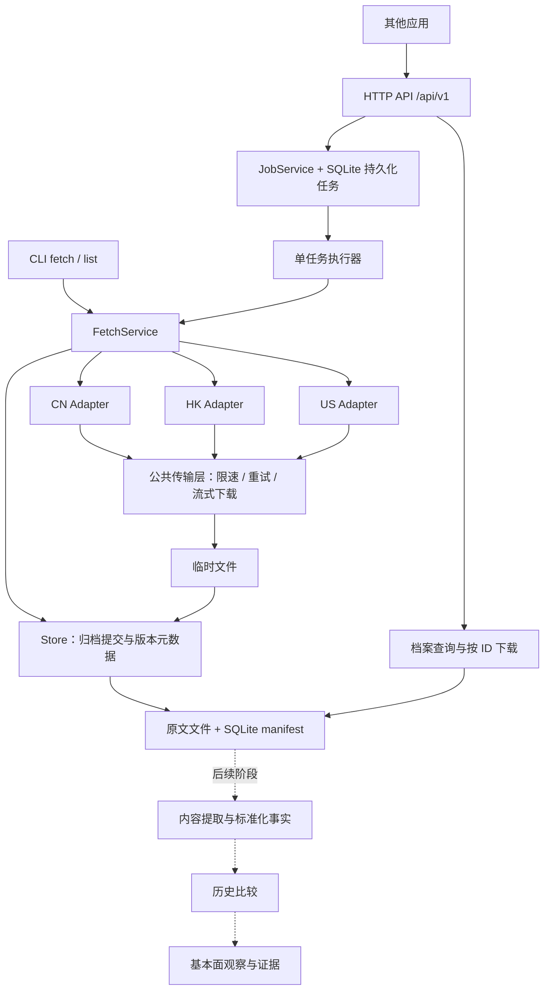

# reports-fetcher 系统架构

| 项目 | 内容 |
|---|---|
| 版本 | v1.2（迭代交付版） |
| 日期 | 2026-09-20 |
| 状态 | 设计阶段，尚未实现或完成源站联调 |
| 关联文档 | [需求规格](./REQUIREMENTS.md)、[迭代计划](./ITERATION_PLAN.md)、[详细设计](./DESIGN.md)、[HTTP 契约](./HTTP_API.md)、[评审意见](./REVIEW.md)、[后续分析方案](./ANALYSIS_ROADMAP.md) |

## 1. 目标与交付范围

一期提供简单、可恢复的财报原文获取工具：输入股票代码，发现最新 N 份符合条件的定期报告，下载 PDF/HTM，归档到本地并维护 SQLite 索引。CLI 和标准 HTTP 入口都属于一期，其他应用无需调用 shell 或理解各市场源站协议。

| 市场 | 来源 | 一期覆盖 |
|---|---|---|
| CN | 巨潮资讯 | 沪深 A 股完整定期报告；北交所暂列后续，不宣称已覆盖 |
| HK | 港交所披露易 | 年报、中期报告；经实测识别的自愿季度报告可显式选择 |
| US | SEC EDGAR | 10-Q、10-K、20-F 主文档与可识别修订版；6-K 业绩附件识别后续做 |

官方披露来源不等于稳定公开 API：巨潮、披露易网页接口需在开发早期实测和保存响应样本。美股一期不承诺覆盖所有申报形态（如 40-F）；未支持类型应明确返回能力限制。

**一期必须完成**：证券规范化与源站确认、报告发现/筛选、下载/归档/去重/恢复、CLI fetch/list、HTTP 异步任务与档案读取、基础鉴权、OpenAPI、离线测试及真实样本验收。

**一期不实现**：财报内容提取、指标计算、基本面分析、GUI、内置定时调度、多租户、多实例部署、分布式消息队列、公开财报再分发。调度由调用方或外部 cron 承担；HTTP 按同一使用方的内部应用共享档案设计。

## 2. 总体结构



| 层 | 职责与约束 |
|---|---|
| CLI / HTTP | 参数、展示、鉴权及传输协议；不含来源筛选规则 |
| JobService / 执行器 | 持久化入队、请求幂等、状态和恢复；一个任务内部可跨市场并行 |
| FetchService | 编排 resolve → discover → select → download → archive；统一结果、覆盖缺口与失败隔离 |
| 市场适配器 | 封装来源协议、分页、市场特定标题/日期/版本判断；不直接落盘 |
| 公共传输层 | 所有请求（包括 resolve、列表、分页、重试、重定向）统一限速、超时和校验 |
| Store | 唯一归档提交方，管理文件及数据库一致性、来源去重和内容版本 |
| 后续分析层 | 消费已归档的特定文件版本，产出事实、比较和带出处的解释；一期仅记录需求 |

适配器接口是主要扩展点，但新增市场仍需来源验证、类型映射和验收样本，不能以“只加一个文件/百行代码”估算成本。通用日期工具不承载市场特定披露规则。

## 3. 技术与部署决策

| 项 | 建议 | 原因及代价 |
|---|---|---|
| 运行交付 | Docker 容器（主力） | 开发/探测/CLI/服务统一在容器内执行；宿主机仅要求 Docker，不提供 venv 交付路径 |
| Python | 3.11+（容器内） | 与 StrEnum、tomllib 保持一致 |
| 来源 HTTP | requests；显式统一重试循环 | 三市场并发有限；确保每次重试进入共享限速器 |
| 服务 API | FastAPI + Uvicorn | OpenAPI、校验和标准 HTTP 服务；不继续维持“全部只有 requests”的依赖假设 |
| 索引 / 任务 | SQLite WAL | 单机低并发足够；每线程独立连接、短事务和 busy_timeout |
| CLI | argparse | 命令少，标准库足够 |
| 并发 | 一个服务进程、一个任务执行器、每任务最多三个市场线程 | 减少重复工作并共享源站预算；任务查询不等待下载完成 |
| 日志 | logging | request_id / job_id / report_id 可关联，敏感字段脱敏 |

抓取核心直接依赖 requests；服务依赖作为 `server` 可选安装组（FastAPI/Pydantic/Uvicorn，以实现时锁定版本为准）；测试依赖独立。Docker 是主力运行与交付方式：Dockerfile 提供 dev（探测/开发）、runtime（CLI）、server（HTTP）多阶段目标，docker-compose.yml 提供对应服务；归档目录、配置、日志与 fixture 经 bind mount / 环境变量注入容器。容器内进程监听 0.0.0.0，端口默认仅发布到宿主机 127.0.0.1，跨主机调用使用令牌和 HTTPS。

同一归档根目录仅允许一个写入所有者。服务运行时，独立 CLI 写入应明确报 `store_in_use`，应用改用 HTTP；服务停止时 CLI 可独立运行。使用操作系统进程锁，不靠遗留锁文件是否存在判断。P0 不通过增加 Uvicorn workers 提升吞吐；这会复制队列执行器和限速预算。

## 4. 模块边界

```text
reports_fetcher/
  cli.py                 # fetch/list/serve
  api.py                 # 路由、鉴权、OpenAPI、Problem Details
  api_models.py          # 外部请求/响应模型
  jobs.py                # 持久化任务与单执行器
  core.py                # 共用抓取用例
  models.py              # Symbol / Report / DiscoveryResult / FetchResult
  config.py              # TOML / 默认值 / 环境配置
  symbol.py              # 代码与显式市场解析
  period.py              # 通用日期工具，不猜测会计期间
  downloader.py          # 共享传输层，流式下载到临时文件
  store.py               # 唯一文件提交、索引、恢复
  adapters/              # cn_cninfo.py / hk_hkexnews.py / us_edgar.py
  Dockerfile / docker-compose.yml / .dockerignore   # 容器化交付（主力，见 §3）
  tools/probe/           # I0 来源契约探测脚本（dev 镜像内运行，不进生产镜像）
```

外部契约以 [HTTP_API.md](./HTTP_API.md) 为准，服务层不调用 CLI 子进程。后续分析暂不建空模块、向量库或模型调用框架。

## 5. 报告选择与“最新 N 份”

N 默认 4，表示最多 N 个逻辑报告组，**不等于最近 N 个季度**。各市场先明确类型及语言、识别完整报告、处理修订版，再选择；不会以下载失败为理由悄悄用更早报告补足数量。

| 项 | 统一规则 |
|---|---|
| 默认类型 | CN Q1/H1/Q3/FY；HK ANNUAL/INTERIM；US 10-Q/10-K/20-F |
| 分组 | 主体/证券 + 已知报告期 + 基础类型 + 报表范围（已知时）；组内按语言偏好选择完整版本，修订关系保留 |
| 语言 | CN/HK 优先中文，缺失时回退可用全文；US 保留来源语言；不全局排除 English |
| 版本 | 默认选最新可确认完整版本；单独更正通知/摘要不冒充全文；无法判断是否完整则保留警告与候选关系 |
| 排序 | 已知报告期倒序，再按公告日期、source_id 稳定排序；未知报告期单独按公告日排序、置于已知期之后 |
| 未知日期 | 保留 null 和 period_source=unknown，不用公告日或 12-31 猜造期末；未知期条目不能按“空日期相等”合并。HK 年报/中期可在归档后从本地 PDF 原文提取明确期末日（period_source=document），仅补未知、绝不覆盖可信期 |
| 覆盖 | 按需翻页/扩大窗口；返回 requested/selected、检索范围、是否穷尽/截断、警告；不足 N 明确告知 |

港股可能只有半年频率，美股 10-K 是年度报告，20-F 也不能补齐季度序列。US 历史检索不能只依赖 `filings.recent`，必要时读取 `filings.files`；CN/HK 扩窗与分页设有界预算，耗尽预算也必须显式报告。

## 6. 归档与恢复

默认布局：

```text
reports/
  CN/600519/2025-06-30__H1__标题__{report_id}__{artifact_id}.pdf
  HK/00700/2025-06-30__INTERIM__标题__{report_id}__{artifact_id}.pdf
  US/AAPL/2025-06-28__10-Q__标题__{report_id}__{artifact_id}.htm
  manifest.sqlite3
```

可选 nested 布局再增加报告期目录。未知日期使用 `unknown` 标识，不能靠文件名字符顺序表达报告排序。

- 来源去重键 `(market, symbol, source_id)`；report_id 持久化后不变，source_id 的市场构造规则见详细设计。
- 文件版本以 artifact_id + SHA-256 标识；同来源刷新后内容变化保留旧版本，不覆盖用于历史分析的证据。
- 下载器只产生已校验临时文件及摘要；Store 提交到最终路径后再事务标记 done，避免重复写两次。
- 数据库和文件系统没有共同事务。提交 intent、原子改名、完成标记之间的中断需要重启核对，不能承诺它们天然原子。
- 命中 done 仍检查路径和文件；异常时重新获取，旧文件版本保留。schema_version 管理数据库演进，失败尝试与已成功版本分开记录。

## 7. HTTP 一期要求

标准调用链为提交 `/api/v1/fetch-jobs` → 返回 202 与任务 ID → 轮询任务 → 取得 report_id → 按 ID 查询元数据/下载文件。任务落库后才返回成功受理；同一客户端幂等键重试返回原任务。

GET reports 只读归档，不触发联网。任务失败作为任务数据返回；客户端输入错误使用统一 Problem Details。完整请求字段、状态机、边界限制、鉴权、分页和文件响应见 [HTTP_API.md](./HTTP_API.md)。

## 8. 非功能需求与风险

| 项 | 约束 |
|---|---|
| 限速 | SEC 全部相关域名合计最小间隔 0.13 秒（保守约 8 req/s）；同一使用方其他实例也计入总预算。CN/HK 初始保守间隔 0.5/0.3 秒，实测后调整 |
| 重试 | 网络异常、429、明确可重试 5xx 有界退避、抖动，尊重 Retry-After；403 风控等不无限重试 |
| 资源 | 连接/读取超时、任务总时限、下载实际字节上限（默认 200 MiB）、发现请求预算、队列和批量上限 |
| 校验 | PDF/HTML 结构与来源特征联合校验；HTTP 200 或 `<html` 不能证明拿到财报 |
| 时间 | 报告期用来源明确的期末；公告日期保留市场语义；运行时间统一 UTC，保留原始值/时区 |
| 质量 | 空结果、历史不足、类型不支持、源站失败分开；未知字段不猜填，保留可查询警告 |
| 存储 | 不自动递归清理目录；运维清理和保留策略后续独立确定；不会为刷新删除原有有效文件 |
| 可观测 | 来源请求数、失败/重试、耗时、排队数、覆盖缺口、版本校验状态；不记录令牌/Cookie |
| 来源变化 | 真实响应 fixture + 冒烟记录；非公开契约变化返回可诊断错误，不以空结果掩盖解析失败 |

SEC 请求预算依据：[Developer Resources](https://www.sec.gov/about/developer-resources)。来源探测失败不应阻断 API 健康接口；就绪检查仅检查本服务依赖。

## 9. 已纳入整体架构的后续需求

| 编号 | 系统需求 | 一期衔接 |
|---|---|---|
| A-01 | 读取正文、表格和附注；PDF 文本/OCR、HTML/XBRL 分路径处理 | 原文独立保存，稳定 ID 和 checksum |
| A-02 | 标准化科目、币种/单位、会计准则、主体/报表范围和期间类型 | 保留来源主体 ID、类型/语言、已知报告期及可信来源 |
| A-03 | 同比/环比/TTM、累计转单季与历史重述比较 | 完整披露版本可追溯；未知期不伪造 |
| A-04 | 以可验证事实生成增长、盈利、现金流、偿债等基本面观察 | 内容分析独立于抓取链路；失败可单独重跑 |
| A-05 | 每个数值和判断可回到页码、表格或 XBRL context，并记录规则/模型版本 | report_id/artifact_id 可稳定寻址，不能随重试改变 |
| A-06 | 数据不足或不可比时明确解释，不制造数值、季度或确定结论 | 返回覆盖缺口，为后续历史补取提供依据 |
| A-07 | 后续以独立事实提供层和分析规则定义衔接量化数据与附注证据；规则声明市场/行业、期间与数据前置条件 | 官方原文获取保持独立，不把第三方财务 API 或模型耦合进一期 |
| A-08 | 执行状态、数据覆盖和风险程度分别表达；缺失数据不能被判为通过或低风险 | 一期保留来源错误与覆盖缺口，供后续传播质量状态 |
| A-09 | 每次分析固定目标期间/信息截止日、输入快照和处理版本，可重复计算及比较 | 报告及文件版本可稳定引用，不覆盖历史证据 |
| A-10 | 指标由统一、版本化计算层生成；未来 API、图表、文字报告共用结果与证据，缺失/负值/极值如实表达 | 一期仅保留可引用原文及元数据，不引入渲染或分析宿主依赖 |

方案记录在 [ANALYSIS_ROADMAP.md](./ANALYSIS_ROADMAP.md)，其中 §9–10 记录 financial-report-minesweeper 与 DB-GPT financial-report-analyzer 的借鉴与取舍。上述是长期系统要求，不意味着一期交付 OCR、指标表、LLM 或基本面评分。

## 10. 实施顺序与一期完成定义

一期按迭代分步开发、分步交付：需求基线见 [REQUIREMENTS.md](./REQUIREMENTS.md)，迭代划分、每迭代验收标准（DoD）与需求覆盖矩阵见 [ITERATION_PLAN.md](./ITERATION_PLAN.md)。总览：

| 迭代 | 主题 | 结束时新增可用能力 |
|---|---|---|
| I0 | 来源契约验证与 fixture 冻结 | 三市场契约事实可复核，后续迭代可估时 |
| I1 | 核心链路垂直切片（US 先行） | CLI 端到端可用（美股） |
| I2 / I3 | CN / HK 适配器 | A 股可用 / 三市场 CLI 归档（原始需求达成） |
| I4 | 可靠性硬化 | 长跑批量、崩溃恢复与内容版本安全 |
| I5 | HTTP 服务与持久化任务 | 其他应用可按 [HTTP_API.md](./HTTP_API.md) 调用 |
| I6 | 一期验收与发布 | 一期完成定义达成 |

工期估算在 I0 完成后按迭代给出（v1.0 的 2.5 人日估算已撤回）。I3 结束即满足原始需求（三市场 CLI 归档），此后的迭代是一期范围的补全，可在任意迭代边界暂停而不损失已有可用性。

一期完成要求：三市场承诺类型的文件可用；立即重跑不重复下载；同名/修订文件不覆盖；单证券失败隔离；HTTP 全调用链可用；故障/限流/空结果可区分；文档与实际契约一致。性能作为记录环境后的目标，不承诺所有外网条件下固定分钟数。

## 11. 参考

- [巨潮资讯](https://www.cninfo.com.cn/)、[披露易](https://www.hkexnews.hk/)：来源网站；本次未验证网页接口契约。
- [SEC EDGAR APIs](https://www.sec.gov/search-filings/edgar-application-programming-interfaces)：历史申报及结构化事实 API。
- [Python StrEnum](https://docs.python.org/3/library/enum.html#enum.StrEnum)、[tomllib](https://docs.python.org/3/library/tomllib.html)：3.11+ 基线依据。
- [FastAPI](https://fastapi.tiangolo.com/features/)：OpenAPI/JSON Schema 与校验支持。
